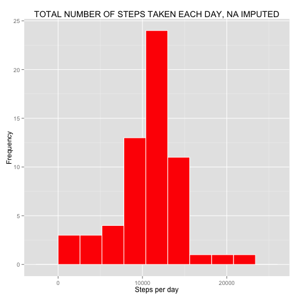

# Introduction

This assignment makes use of data from a personal activity monitoring device. This device collects data at 5 minute intervals through out the day. The data consists of two months of data from an anonymous individual collected during the months of October and November, 2012 and include the number of steps taken in 5 minute intervals each day.

The data for this assignment can be downloaded from the course web site:

Dataset: Activity monitoring data [52K]
The variables included in this dataset are:

steps: Number of steps taking in a 5-minute interval (missing values are coded as 𝙽𝙰)
date: The date on which the measurement was taken in YYYY-MM-DD format
interval: Identifier for the 5-minute interval in which measurement was taken
The dataset is stored in a comma-separated-value (CSV) file and there are a total of 17,568 observations in this dataset.

# Loading and preprocessing the data


```r
# unzip file
unzip("activity.zip")
# read csv file
activity <- read.csv("activity.csv", colClasses = c("integer", "Date", "factor"))
str(activity) # 17568 obs and 3 variables
```

```
## 'data.frame':	17568 obs. of  3 variables:
##  $ steps   : int  NA NA NA NA NA NA NA NA NA NA ...
##  $ date    : Date, format: "2012-10-01" "2012-10-01" ...
##  $ interval: Factor w/ 288 levels "0","10","100",..: 1 226 2 73 136 195 198 209 212 223 ...
```

```r
summary(activity) # NA's: 2304 in steps, 0 in date, 0 in interval
```

```
##      steps             date               interval    
##  Min.   :  0.00   Min.   :2012-10-01   0      :   61  
##  1st Qu.:  0.00   1st Qu.:2012-10-16   10     :   61  
##  Median :  0.00   Median :2012-10-31   100    :   61  
##  Mean   : 37.38   Mean   :2012-10-31   1000   :   61  
##  3rd Qu.: 12.00   3rd Qu.:2012-11-15   1005   :   61  
##  Max.   :806.00   Max.   :2012-11-30   1010   :   61  
##  NA's   :2304                          (Other):17202
```

```r
# omit NA
activ_nna <- na.omit(activity)
str(activ_nna) # 15264 obs and 3 variables
```

```
## 'data.frame':	15264 obs. of  3 variables:
##  $ steps   : int  0 0 0 0 0 0 0 0 0 0 ...
##  $ date    : Date, format: "2012-10-02" "2012-10-02" ...
##  $ interval: Factor w/ 288 levels "0","10","100",..: 1 226 2 73 136 195 198 209 212 223 ...
##  - attr(*, "na.action")=Class 'omit'  Named int [1:2304] 1 2 3 4 5 6 7 8 9 10 ...
##   .. ..- attr(*, "names")= chr [1:2304] "1" "2" "3" "4" ...
```

# What is mean total number of steps taken per day?


```r
# Calculate the total number of steps taken per day
stepsday <- aggregate(activ_nna$steps, list(day = activ_nna$date), FUN = "sum")
stepsday$x
```

```
##  [1]   126 11352 12116 13294 15420 11015 12811  9900 10304 17382 12426
## [12] 15098 10139 15084 13452 10056 11829 10395  8821 13460  8918  8355
## [23]  2492  6778 10119 11458  5018  9819 15414 10600 10571 10439  8334
## [34] 12883  3219 12608 10765  7336    41  5441 14339 15110  8841  4472
## [45] 12787 20427 21194 14478 11834 11162 13646 10183  7047
```

```r
# Make a histogram of the total number of steps taken each day
library(ggplot2)
g1 <- ggplot(stepsday, aes(x))
g1 + geom_histogram(binwidth =2600, colour = "white", fill = "red") + labs(title = "TOTAL NUMBER OF STEPS TAKEN EACH DAY", x = "Steps per day", y = "Frequency")
```

 

```r
# Calculate and report the mean and median of the total number of steps taken per day.
str(stepsday)
```

```
## 'data.frame':	53 obs. of  2 variables:
##  $ day: Date, format: "2012-10-02" "2012-10-03" ...
##  $ x  : int  126 11352 12116 13294 15420 11015 12811 9900 10304 17382 ...
```

```r
mean(stepsday$x)
```

```
## [1] 10766.19
```

```r
median(stepsday$x)
```

```
## [1] 10765
```

```r
meanstepsnona <- mean(stepsday$x)
medianstepsnona <- median(stepsday$x)
```

# What is the average daily activity pattern?


```r
# Make a time series plot (i.e. 𝚝𝚢𝚙𝚎 = "𝚕") of the 5-minute interval (x-axis) and the average number of steps taken, averaged across all days (y-axis)
stepsinterval <- aggregate(activ_nna$steps, list(interval = as.numeric(as.character(activ_nna$interval))), FUN = "mean" )
g2 <- ggplot(stepsinterval, aes(interval, x))
g2 + geom_line(stat = "identity", color = "blue", size = 1) + labs(title = "TIME SERIES PLOT OF THE 5-MINUTE INTERVAL", x = "Interval (5-minute)", y = "Average number of steps taken")
```

 

```r
# Which 5-minute interval, on average across all the days in the dataset, contains the maximum number of steps?
stepsinterval[stepsinterval$x == max(stepsinterval$x),]
```

```
##     interval        x
## 104      835 206.1698
```

# Imputing missing values


```r
# Calculate and report the total number of missing values in the dataset (i.e. the total number of rows with 𝙽𝙰s)
sum(is.na(activity))
```

```
## [1] 2304
```

```r
# Devise a strategy for filling in all of the missing values in the dataset. The strategy does not need to be sophisticated. For example, you could use the mean/median for that day, or the mean for that 5-minute interval, etc.
#Create a new dataset that is equal to the original dataset but with the missing data filled in.
aggregate(is.na(activity$steps), list(day = activity$date), FUN = "sum") #We see that missing values are concentrated on some days and on those days all steps are lost.
```

```
##           day   x
## 1  2012-10-01 288
## 2  2012-10-02   0
## 3  2012-10-03   0
## 4  2012-10-04   0
## 5  2012-10-05   0
## 6  2012-10-06   0
## 7  2012-10-07   0
## 8  2012-10-08 288
## 9  2012-10-09   0
## 10 2012-10-10   0
## 11 2012-10-11   0
## 12 2012-10-12   0
## 13 2012-10-13   0
## 14 2012-10-14   0
## 15 2012-10-15   0
## 16 2012-10-16   0
## 17 2012-10-17   0
## 18 2012-10-18   0
## 19 2012-10-19   0
## 20 2012-10-20   0
## 21 2012-10-21   0
## 22 2012-10-22   0
## 23 2012-10-23   0
## 24 2012-10-24   0
## 25 2012-10-25   0
## 26 2012-10-26   0
## 27 2012-10-27   0
## 28 2012-10-28   0
## 29 2012-10-29   0
## 30 2012-10-30   0
## 31 2012-10-31   0
## 32 2012-11-01 288
## 33 2012-11-02   0
## 34 2012-11-03   0
## 35 2012-11-04 288
## 36 2012-11-05   0
## 37 2012-11-06   0
## 38 2012-11-07   0
## 39 2012-11-08   0
## 40 2012-11-09 288
## 41 2012-11-10 288
## 42 2012-11-11   0
## 43 2012-11-12   0
## 44 2012-11-13   0
## 45 2012-11-14 288
## 46 2012-11-15   0
## 47 2012-11-16   0
## 48 2012-11-17   0
## 49 2012-11-18   0
## 50 2012-11-19   0
## 51 2012-11-20   0
## 52 2012-11-21   0
## 53 2012-11-22   0
## 54 2012-11-23   0
## 55 2012-11-24   0
## 56 2012-11-25   0
## 57 2012-11-26   0
## 58 2012-11-27   0
## 59 2012-11-28   0
## 60 2012-11-29   0
## 61 2012-11-30 288
```

```r
mean(activ_nna$steps)
```

```
## [1] 37.3826
```

```r
sd(activ_nna$steps)
```

```
## [1] 111.9955
```

```r
sd(stepsday$x) # The standard error of the mean of steps by interval is large. It would be good to find a more refined way to resolve the complaint. As you can see in the last exercise, there are significant differences between weekends and weekdays and there are also significant differences along every day. This would allow a better allocation, but let's simplify, as suggested by the approach of the exercise, imputing the average of the 5-minute intervals.
```

```
## [1] 4269.18
```

```r
activimp <- activity # The new dataset is "activimp"
for (i in 1:nrow(activimp)) {if (is.na(activimp$steps[i])) {activimp$steps[i] = stepsinterval[which(activimp$interval[i] == stepsinterval$interval), ]$x}}
str(activimp)
```

```
## 'data.frame':	17568 obs. of  3 variables:
##  $ steps   : num  1.717 0.3396 0.1321 0.1509 0.0755 ...
##  $ date    : Date, format: "2012-10-01" "2012-10-01" ...
##  $ interval: Factor w/ 288 levels "0","10","100",..: 1 226 2 73 136 195 198 209 212 223 ...
```

```r
summary(activimp)
```

```
##      steps             date               interval    
##  Min.   :  0.00   Min.   :2012-10-01   0      :   61  
##  1st Qu.:  0.00   1st Qu.:2012-10-16   10     :   61  
##  Median :  0.00   Median :2012-10-31   100    :   61  
##  Mean   : 37.38   Mean   :2012-10-31   1000   :   61  
##  3rd Qu.: 27.00   3rd Qu.:2012-11-15   1005   :   61  
##  Max.   :806.00   Max.   :2012-11-30   1010   :   61  
##                                        (Other):17202
```

```r
#Make a histogram of the total number of steps taken each day and Calculate and report the mean and median total number of steps taken per day. Do these values differ from the estimates from the first part of the assignment? What is the impact of imputing missing data on the estimates of the total daily number of steps?
#plot
stepsdayimp <- aggregate(activimp$steps, list(day = activimp$date), FUN = "sum")
g3 <- ggplot(stepsdayimp, aes(x))
g3 + geom_histogram(binwidth = 2600, colour = "white", fill = "red") + labs(title = "TOTAL NUMBER OF STEPS TAKEN EACH DAY, NA IMPUTED", x = "Steps per day", y = "Frequency")
```

 

```r
#mean and median.
stepsdaynaimp <- aggregate(activimp$steps, list(day = activimp$date), FUN = "sum")
stepsdaynaimp$x
```

```
##  [1] 10766.19   126.00 11352.00 12116.00 13294.00 15420.00 11015.00
##  [8] 10766.19 12811.00  9900.00 10304.00 17382.00 12426.00 15098.00
## [15] 10139.00 15084.00 13452.00 10056.00 11829.00 10395.00  8821.00
## [22] 13460.00  8918.00  8355.00  2492.00  6778.00 10119.00 11458.00
## [29]  5018.00  9819.00 15414.00 10766.19 10600.00 10571.00 10766.19
## [36] 10439.00  8334.00 12883.00  3219.00 10766.19 10766.19 12608.00
## [43] 10765.00  7336.00 10766.19    41.00  5441.00 14339.00 15110.00
## [50]  8841.00  4472.00 12787.00 20427.00 21194.00 14478.00 11834.00
## [57] 11162.00 13646.00 10183.00  7047.00 10766.19
```

```r
meanstepsimp <- mean(stepsdaynaimp$x)
medianstepsimp <- median(stepsdaynaimp$x)
meanstepsimp - meanstepsnona
```

```
## [1] 0
```

```r
medianstepsimp - medianstepsnona
```

```
## [1] 1.188679
```

There is no difference in the mean and the median difference is very small.

If we look at histograms, its shape is very similar. However, core values grow significantly with the complaint. It stands to reason, since we have imputed a global average

# Are there differences in activity patterns between weekdays and weekends?
For this part the 𝚠𝚎𝚎𝚔𝚍𝚊𝚢𝚜() function may be of some help here. Use the dataset with the filled-in missing values for this part.


```r
# Create a new factor variable in the dataset with two levels – “weekday” and “weekend” indicating whether a given date is a weekday or weekend day.
library(dplyr)
activimp <- mutate(activimp, weekdayend = ifelse(weekdays(activimp$date) == "sábado" | weekdays(activimp$date) == "domingo", "Weekend", "Weekday"))
activimp$weekdayend <- as.factor(activimp$weekdayend)
str(activimp)
```

```
## 'data.frame':	17568 obs. of  4 variables:
##  $ steps     : num  1.717 0.3396 0.1321 0.1509 0.0755 ...
##  $ date      : Date, format: "2012-10-01" "2012-10-01" ...
##  $ interval  : Factor w/ 288 levels "0","10","100",..: 1 226 2 73 136 195 198 209 212 223 ...
##  $ weekdayend: Factor w/ 2 levels "Weekday","Weekend": 1 1 1 1 1 1 1 1 1 1 ...
```

```r
summary(activimp)
```

```
##      steps             date               interval       weekdayend   
##  Min.   :  0.00   Min.   :2012-10-01   0      :   61   Weekday:12960  
##  1st Qu.:  0.00   1st Qu.:2012-10-16   10     :   61   Weekend: 4608  
##  Median :  0.00   Median :2012-10-31   100    :   61                  
##  Mean   : 37.38   Mean   :2012-10-31   1000   :   61                  
##  3rd Qu.: 27.00   3rd Qu.:2012-11-15   1005   :   61                  
##  Max.   :806.00   Max.   :2012-11-30   1010   :   61                  
##                                        (Other):17202
```

```r
# Make a panel plot containing a time series plot (i.e. 𝚝𝚢𝚙𝚎 = "𝚕") of the 5-minute interval (x-axis) and the average number of steps taken, averaged across all weekday days or weekend days (y-axis). See the README file in the GitHub repository to see an example of what this plot should look like using simulated data.
stepsweekdayend <- aggregate(activimp$steps, list(interval = as.numeric(as.character(activimp$interval)), weekdayend = activimp$weekdayend), FUN = "mean")
g4 <- ggplot(stepsweekdayend, aes(x = interval, y = x))
g4 + geom_line(stat = "identity", color = "blue", size = 1) + facet_wrap(~weekdayend, ncol = 2, nrow = 1) + labs(title = "DIFFERENCES IN ACTIVITY PATTERNS BETWEEN WEEKDAYS AND WEEKENDS", x = "Intervals", y = "Average number of steps")
```

 

There is a clear difference in the shape of curves interval average values: both curves have very low values to the interval 500, find its highest point above 750 and fall around 1000; the main difference to this point is that the values of the working days are considerably higher. From that point, the opposite happens, remain higher values weekend.

